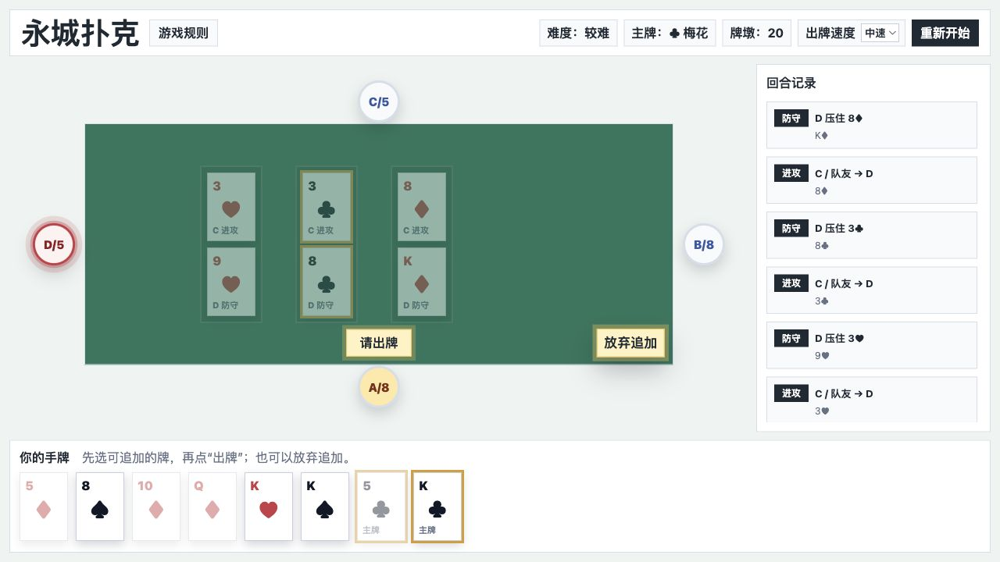

# 永城扑克

## Quick demo

Hosted playable demo:

[Open 永城扑克 from GitLab Pages](http://mervinqi-yongchengpoker-137854.pages.git.ringcentral.com)

Repository:

[Open the GitLab repository](https://git.ringcentral.com/rc-ai-learning/mervinqi-yongchengpoker)

Deployment reference:

[Latest GitLab Pages pipeline](https://git.ringcentral.com/rc-ai-learning/mervinqi-yongchengpoker/-/pipelines)

This project is also optimized for a fast offline demo. No server, package install, account, or network connection is required after the repository is downloaded.

Direct local demo:

1. Open `index.html` in a modern desktop browser.
2. Choose a difficulty level.
3. Play as A against the local AI players.

Optional local server:

```bash
npm run serve
```

Then open:

```text
http://localhost:4173
```

## Project overview

永城扑克 is a browser-based, offline implementation of **永城八张**, a four-player Henan card game also known locally as **打八张**. The project was built for the AI-Native Development Challenge and is intentionally static: no server, account, matchmaking, database, or network dependency is required.

The playable UI is fully Chinese. The source and documentation are kept small enough to inspect, run, test, and iterate during an AI-native development workflow.

## Game description

The game uses a 54-card deck including big and small jokers. Four players sit in order as A, B, C, and D. A/C are partners, and B/D are partners. The human player controls A, with C as the AI partner against B and D.

Before opening hands are dealt, one random suited card is selected as the trump marker and inserted into the first 32 cards. Whoever receives that card becomes the first defender, and that card's suit is trump. Each player starts with eight cards.

Core play:

- The attacking side plays one card at a time against the defender.
- The defender must beat each attack card with a higher card in the same suit, any trump card against a non-trump attack, or a joker.
- Jokers can defend but cannot attack or be added during collection.
- Follow-up attacks are limited to ranks already visible on the table.
- During partner attacks, the main attacker decides first; the partner may attack after the main attacker passes, or immediately if the main attacker has no legal follow-up card.
- Each new attack round requires the main attacker to play at least one card before passing.
- Players draw back up to eight only after the current attack round fully ends.

Defense outcomes:

- If the defender succeeds, that defender becomes the next attacker.
- If the defender collects the table, the attacking side may add legal matching-rank cards for the defender to collect too.
- If defense fails, the attacking team keeps initiative and the attacker's partner continues against the next opponent.

Available AI difficulty levels:

- 简单: conservative AI for learning the rules.
- 较难: balanced AI and the default test mode.
- 困难: more aggressive AI that preserves stronger defensive cards.
- 超难: the most aggressive AI profile, with more pressure during follow-up attacks and collection.

## Screenshots



## Setup instructions

No package installation is required.

Requirements:

- A modern desktop browser.
- Node.js only if you want to run tests or use the included local static server script.

Run tests:

```bash
npm test
```

## Run instructions

Direct run:

1. Open `index.html` in a browser.
2. Choose 简单, 较难, 困难, or 超难.
3. Select a legal card from your hand.
4. Use the flashing action buttons on the table to 出牌, 收牌, 放弃追加, 不给牌, or confirm 防守成功.
5. Use 重新开始 to return to the difficulty selector.

Optional local server:

```bash
npm run serve
```

Then open:

```text
http://localhost:4173
```

Controls:

- Mouse / trackpad: select cards and click table action buttons.
- 出牌速度: choose 慢速, 中速, or 快速 for AI action pacing.
- 游戏规则: open the in-game rule summary.
- 重新开始: return to difficulty selection.

## Project structure

```text
.
├── index.html
├── docs/
│   └── screenshot-game.png
├── src/
│   ├── app.js
│   ├── game.js
│   └── styles.css
├── tests/
│   └── game.test.js
├── SPEC.md
├── ARCHITECTURE.md
├── RETROSPECTIVE.md
└── README.md
```
